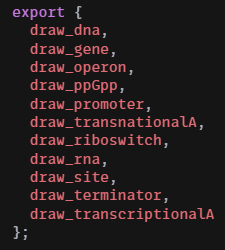

# Introducción

DNAFeaturesGL es una librería gráfica, que genera el dibujado (elementos genéticos) en base a datos biológicos. Pretende facilitar la visualización a los usuarios sobre datos genéticos. Esta librería se crea para dar optimización al dibujado de los elementos que participan en la regulación transcripcional de E. Coli k-12, cada elemento es graficado con una función única, antes de llegar a esta función los parámetros de entrada ya han sido validados y en caso de contener errores, no permite el dibujado. 

# Nombre de la funcionalidad

#### **Test de librería**.

#### Representación gráfica de los Elementos Genéticos e Incomplete.

Cada objeto biológico tiene una estructura gráfica que deberá respetarse, por ejemplo, el objeto gene es representado por una figura tipo flecha como se muestra en la siguiente Tabla.

Figura 1. Representación gráfica de elementos genéticos.

#### Funciones de cada elemento.

Figura 2. Funciones de graficado.

En la Figura anterior se muestran las funciones que exporta  la librería DNAFeaturesGL. Estas funciones, no pueden ser visualizadas por el usuario, el usuario únicamente puede importar estas funciones para su implementación.

#### Implementación.

Para la implementación de DNAFeaturesGL, se necesitan las siguientes dos importaciones al área de trabajo en la que se encuentre el usuario:

`import { SVG } from "@svgdotjs/svg.js";`

`import { draw_dna, draw_gene, draw_operon } from "dnafeaturesgl";`

En dónde `SVG` se importa de `svg.js` la cual es una librería muy ligera para manipular y animar SVG, permite modificar el tamaño, la posición y el color de los elementos SVG.
La importación de`draw_dna`, `draw_gene` y `draw_operon` que son las funciones de graficado para dicho elemento.

Se muestra un ejemplo de la implementación de los tres elementos genéticos.

Figura 3. Ejemplo de su graficación.

Es importante decir que para la creación del canva (el lienzo en dónde se dibujan los elementos),  se requiere un elemento del DOM de lo contrario no se logra realizar el dibujado.

# Ayuda y soporte

Si el usuario tiene algún comentario, sugerencia o problema de cualquier índole relacionado con este sistema, podrá enviar un correo electrónico a: [regusoft@ccg.unam.mx](mailto:regusoft@ccg.unam.mx)

# Definiciones, acrónimos y abreviaturas

SVG: Gráficos vectoriales escalables.

# Referencias bibliográficas

__Documentos__
Reporte Residencia Profesional_V1.0: DRAWINGTRACESTOOL V4.0 BASADO EN COMPONENTES CON REACT.

__Páginas Web__  
Título de la página Web:  SVG.js
Web link: https://svgjs.com/docs/3.0/

<!---
HISTORIAL DE REVISIONES

**Fecha:** [dd/mm/aaaa]
**Versión:** [#.#]
**Descripción:** [Indicar los cambios que se realizaron en el documento]
**Realizado por: ** [Nombre de la persona que realice los cambios]
**Estado:**[Revisión <Trabajado,  Verificado>, Estable **<**Vo.Bo, Validado>]
[Repetir esta sección por cada versión que se realice en el documento]
-->
